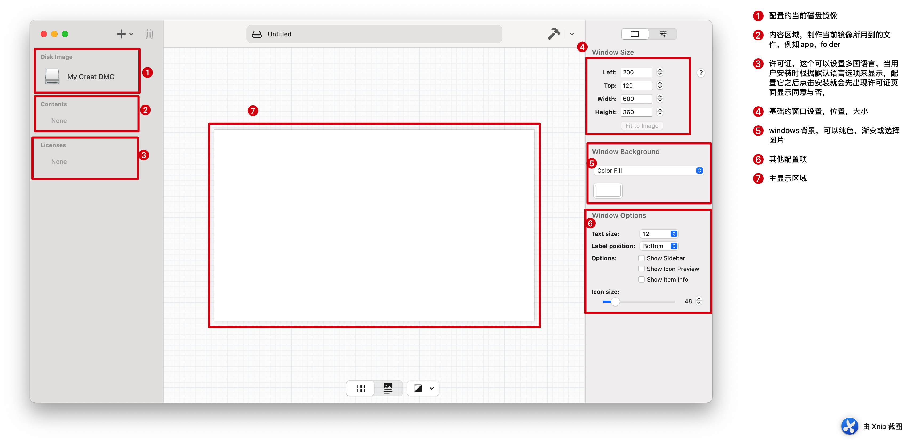
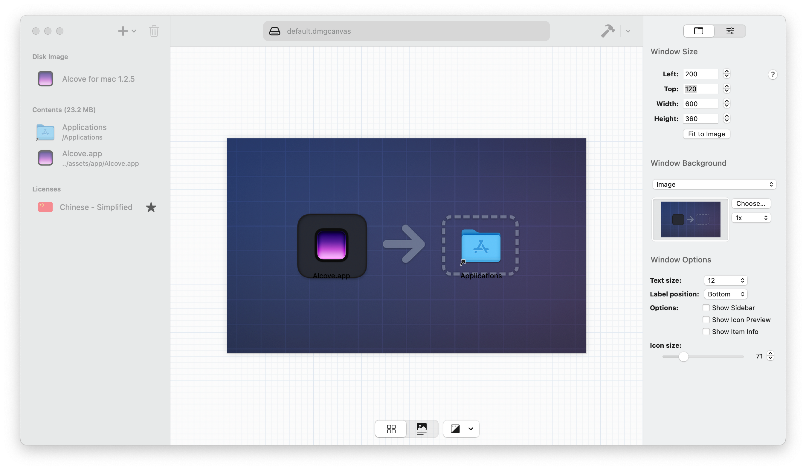
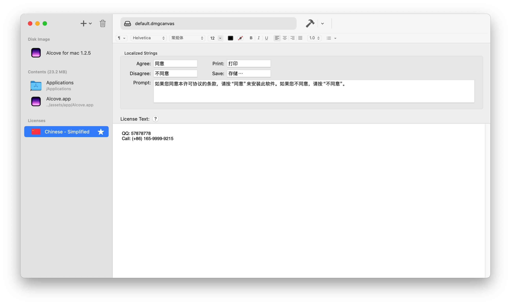
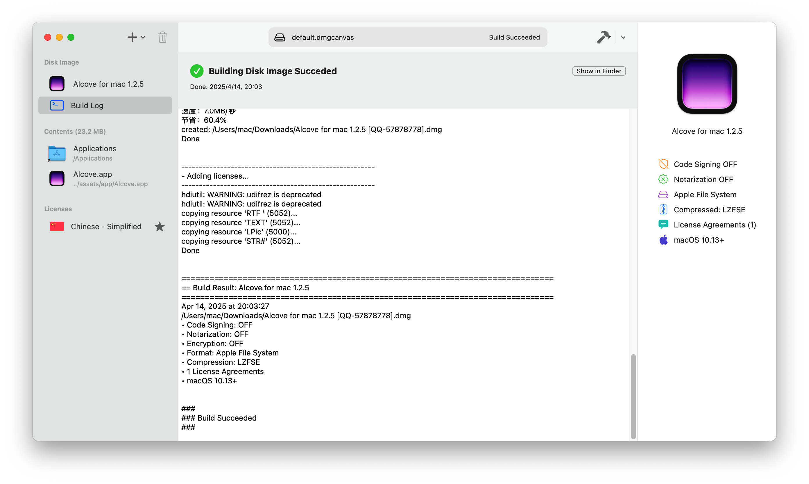
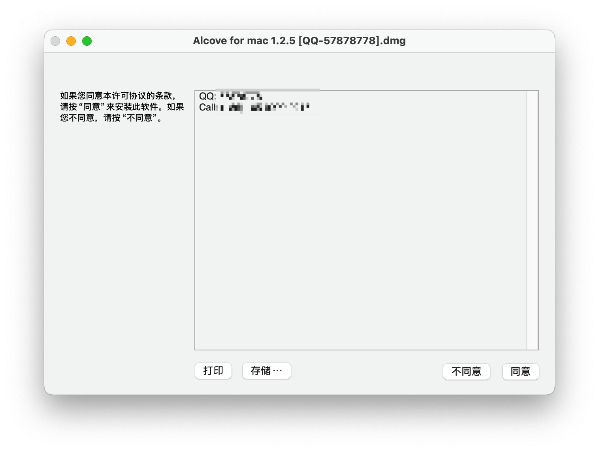
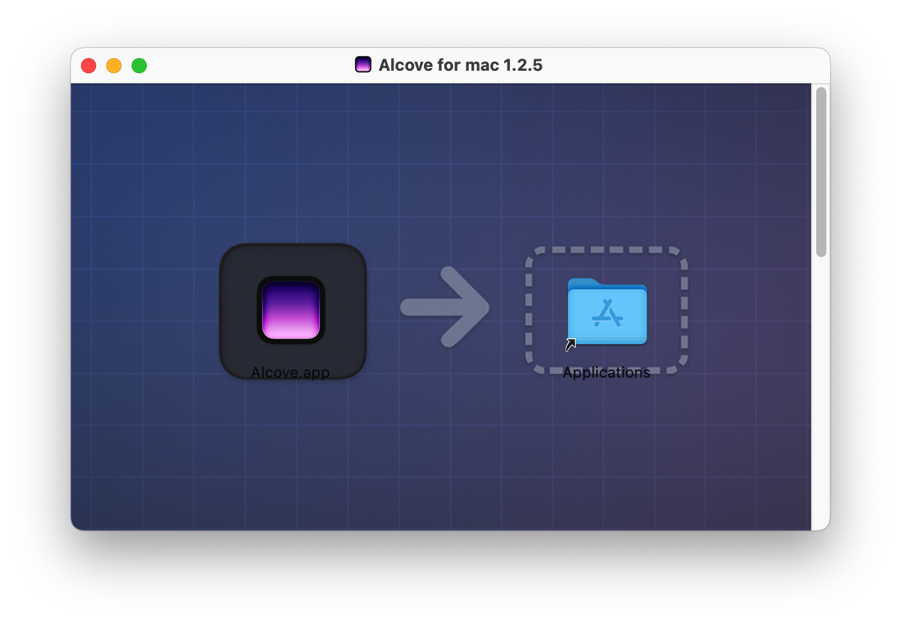

## 介绍它

DMG Canvas 是一款 macOS 平台上的图形化工具，用于创建专业、美观的 DMG 安装镜像文件（Disk Image 文件，通常用于分发 macOS 应用程序）。它的主要作用是让你****以可视化方式设计 DMG 文件的外观和行为****，从而为用户提供更好的安装体验。

官网：[https://www.araelium.com/dmgcanvas](https://www.araelium.com/dmgcanvas)

---

### ✅ DMG Canvas 能做什么？

- ****可视化编辑 DMG 布局****：拖拽应用图标、快捷方式、背景图像等，就像在 Finder 里操作一样；
- ****设置背景图、图标位置和窗口大小****：自定义打开 DMG 时用户看到的布局；
- ****生成代码签名和压缩后的 DMG 文件****：适配 Gatekeeper 和 macOS 的签名策略；
- ****一键构建最终 DMG 文件****：自动化整个创建流程；
- ****脚本支持****：可在构建流程中加入自动化脚本。

---

### 📦 使用场景举例

你有一个 macOS 应用，比如 `MyApp.app`，希望打包为 `MyApp.dmg`，供用户下载安装。通过 DMG Canvas，你可以设置如下：

- 将 MyApp.app 和 /Applications 的快捷方式并排放置；
- 加一个背景图（比如 logo 和安装提示）；
- 设置窗口尺寸和默认打开位置；
- 一键导出 DMG，完成签名和压缩。

---

### 🔧 适合人群

- macOS 应用开发者；
- 需要分发独立应用的独立开发者或小团队；
- 想要提升产品“第一印象”的人（安装包打开即体验感）；

## 下载并安装DMG Canvas

我用夸克网盘分享了「DMG Canvas [qq-57878778].dmg」，点击链接即可保存。打开「夸克APP」，无需下载在线播放视频，畅享原画5倍速，支持电视投屏。

链接：[https://pan.quark.cn/s/427a81d26060](https://pan.quark.cn/s/427a81d26060)

提取码：RGQJ

## 温馨提示
> 在此仓库内已包含所需应用安装包以及背景图片等素材
 
## 界面功能区域介绍

### 基础页面结构

### 主要内容修整好之后

### 配置许可证

### 构建dmg镜像

选择右上角小锤子构建，我这里测试重复构建的时候会报错：（此时需要退出重新打开）  
> Can't configure background image for DMG installation

## 构建产物演示

